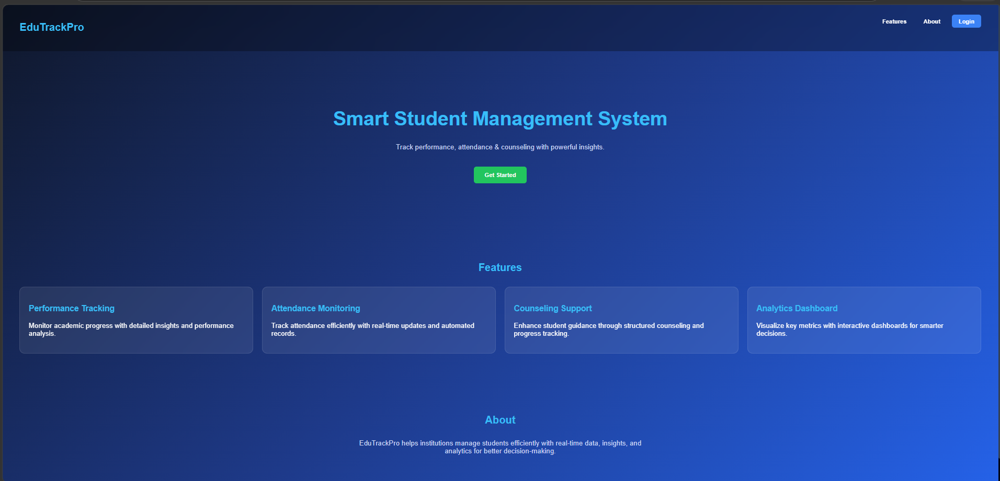
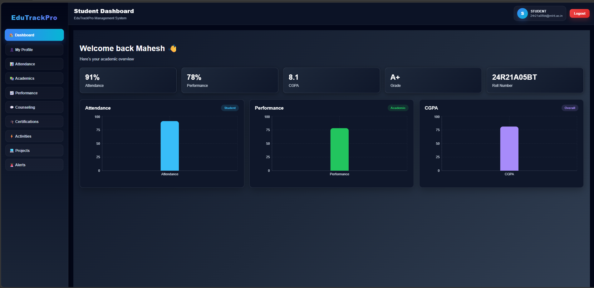
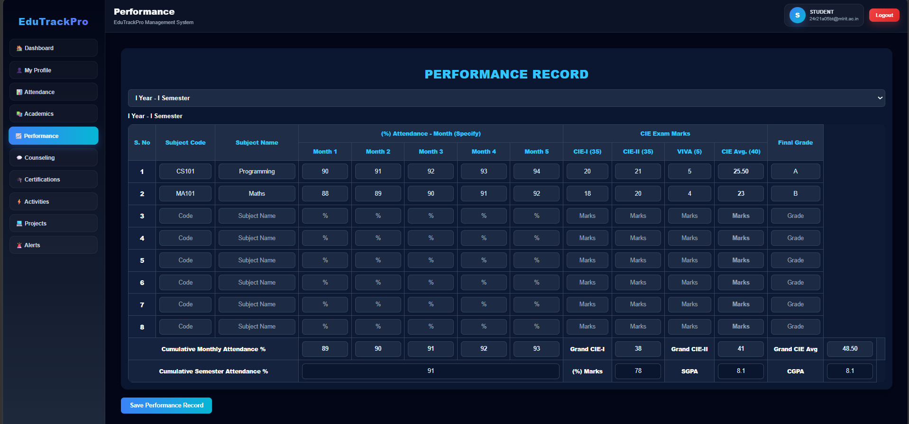
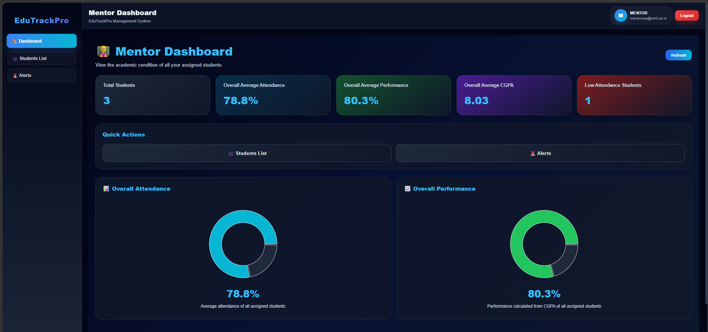
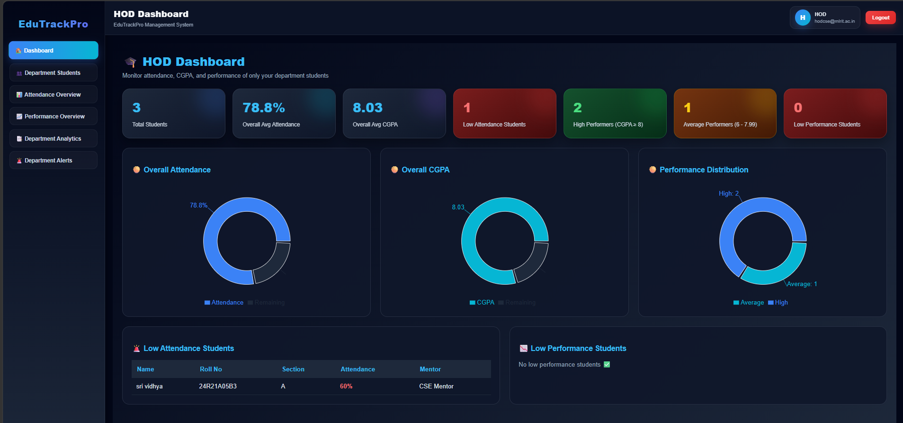
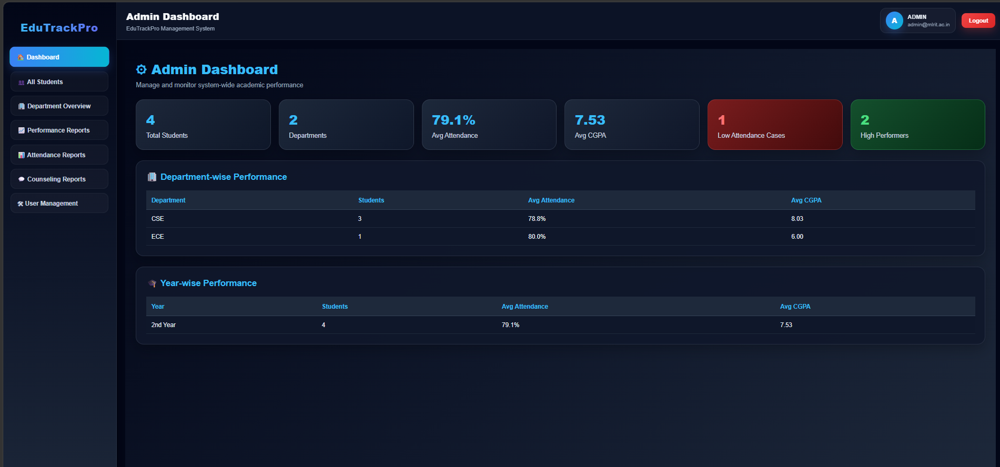

# 🚀 EduTrackPro

EduTrackPro is a **Digital Student Counseling & Academic Performance Management System** designed to replace the traditional physical counseling book with a secure, role-based digital platform.

It helps institutions manage student records, track academic performance, monitor attendance, and streamline counseling processes efficiently.

---

## 🌟 Features

### 👨‍🎓 Student

* View personal profile & academic records
* Track attendance and CGPA
* View performance analytics
* Access counseling records
* Manage certifications, projects & activities

### 👨‍🏫 Mentor

* View assigned students
* Monitor student performance
* Identify low attendance / backlogs
* Access full student records

### 🏫 HOD

* Department-wise analytics
* Section-wise performance insights
* Identify at-risk students
* Monitor overall academic trends

### 🛠️ Admin

* Manage all students across departments
* View reports & analytics
* Access counseling data
* System-wide monitoring

---

## 🧑‍💻 Tech Stack

### Frontend

* React.js
* React Router DOM
* Recharts (for analytics)
* CSS (Custom UI with gradients)

### Backend

* Node.js
* Express.js
* MySQL

---

## 📁 Project Structure

```bash
EduTrackPro/
│
├── src/                # React frontend source
├── public/             # Static files
├── backend/            # Node.js backend
├── screenshots/        # Project screenshots
├── .gitignore
├── package.json
└── README.md
```

---

## 📸 Screenshots

> Add your screenshots inside `screenshots/` folder

### 🔐 Landing Page



### 🔐 Login Page


### 🏠 Dashboard



### 📊 Student Performance



### 👨‍🏫 Mentor Dashboard



### 🏫 HOD Dashboard



### 🛠️ Admin Dashboard



---

## ⚙️ Installation & Setup

### 1️⃣ Clone the repository

```bash
git clone https://github.com/Durgamahesh-11/EduTrackPro.git
cd EduTrackPro
```

---

### 2️⃣ Install frontend dependencies

```bash
npm install
npm start
```

Runs frontend at:
👉 http://localhost:3000

---

### 3️⃣ Setup backend

```bash
cd backend
npm install
npm run dev
```

Runs backend at:
👉 http://localhost:5000

---

## 🔐 Environment Variables

Create a `.env` file inside `backend/` and add:

```env
PORT=5000
DB_HOST=localhost
DB_USER=root
DB_PASSWORD=your_password
DB_NAME=edutrackpro
JWT_SECRET=your_secret_key
```

---

## 🔗 API Configuration

In frontend, update API base URL:

```js
const baseURL = "http://localhost:5000/api";
```

(For deployment, replace with your backend URL)

---

## 📊 Key Functionalities

* Role-based authentication (Student / Mentor / HOD / Admin)
* Attendance tracking system
* CGPA & grade calculation
* Counseling record management
* Performance analytics using charts
* Department & section filtering
* Alert system for low performance

---

## 🚀 Future Enhancements

* PDF report generation
* AI-based counseling suggestions
* Notification system
* HOD approval workflow
* Cloud deployment & scaling

---

## 📌 Live Demo

* Frontend: Coming Soon 🚀
* Backend: Coming Soon 🚀

---

## 👨‍💻 Author

**Durgamahesh**
📌 MLR Institute of Technology

---

## ⭐ Support

If you like this project, give it a ⭐ on GitHub!

---
